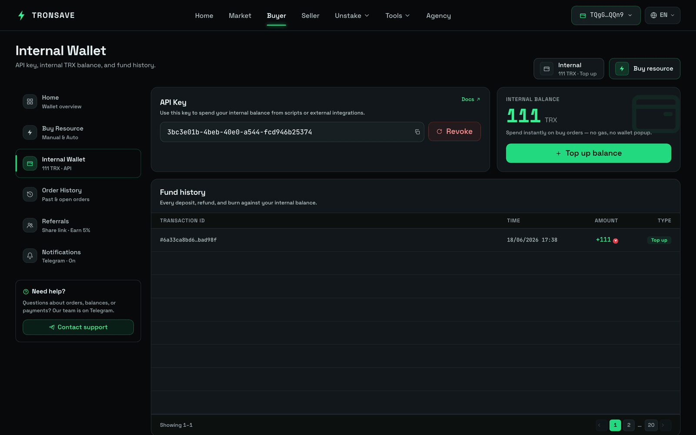

# 自动购买

**自动购买**会自动为目标地址购买能量或带宽。无需手动创建购买订单，TronSave 会根据你一次性配置的规则为你下单，让目标地址永远不会耗尽资源。


自动购买从你的**内部账户**余额中扣款，而不是直接从你连接的钱包中扣款。开始之前请先为内部账户充值。关于内部账户的工作原理，请参阅[价格与 APY](../../concepts/pricing-and-apy.md)以及更全面的[订单类型](../../concepts/order-types.md)概述。


## 设置自动购买规则

### 第 1 步 — 连接钱包

在 [tronsave.io](https://tronsave.io/dashboard/buyer/buy-resource) 连接你的钱包。

### 第 2 步 — 打开 Buyer → Buy Resource

* 选择**能量**或**带宽**。
* 在购买类型下，选择 **Auto**（自动）。

### 第 3 步 — 添加自动购买规则

选择 **Add Auto Buy Energy Rule**（添加自动购买能量规则）按钮。

<figure><figcaption></figcaption></figure>

### 第 4 步 — 检查你的内部余额

<figure><figcaption></figcaption></figure>

自动购买从你的**内部账户余额**中扣款，而不是直接从你的钱包中扣款。要充值，请点击 **Recharge**（充值）并向显示的地址存入 TRX。

### 第 5 步 — 配置规则

**购买订单设置**（每次触发自动购买时应用）：

<table>
  <thead>
    <tr><th>字段</th><th>说明</th></tr>
  </thead>
  <tbody>
    <tr>
      <td><code>Resource Target Address</code></td>
      <td>需要能量或带宽的钱包。它不能是合约地址或任何其他无效地址。</td>
    </tr>
    <tr>
      <td><code>Amount</code></td>
      <td>要购买的资源数量。</td>
    </tr>
    <tr>
      <td><code>Duration</code></td>
      <td>资源租赁的时长。</td>
    </tr>
    <tr>
      <td><code>Price</code></td>
      <td>选择 Fast（快）、Medium（中）、Slow（慢）或 Manual（手动）价格。建议使用 Medium（中）。</td>
    </tr>
  </tbody>
</table>

**资源购买阈值** — 资源余额的最低值。当目标地址的能量或带宽低于此阈值时，系统会自动触发一笔新订单。

**时长限制** — 决定自动购买何时生效。将其设置为 **Always**（始终）或配置自定义时间范围。

**预算限制** — 定义自动购买的停止条件：

* **No Limit**（无限制）— 不受限制地持续购买。
* **Amount Limit**（金额限制）— 当花费的 TRX 总额达到你设置的金额时停止。
* **Order Limit**（订单数量限制）— 当订单数量达到你设置的上限时停止。

保存后，每当目标地址的余额低于阈值时，系统都会自动创建购买订单，直到达到某项预算限制为止。

## 管理自动购买规则

规则创建后，你可以通过以下操作来管理它。

<figure><figcaption></figcaption></figure>

| # | 操作 | 作用 |
| --- | --- | --- |
| 1 | **启用 / 停用** | 在不删除规则的情况下临时停止或重新启动规则。 |
| 2 | **编辑** | 更改阈值、时长、价格或预算限制。 |
| 3 | **删除** | 永久移除该规则。 |
| 4 | **历史** | 查看过去自动购买订单的执行日志 — 资源数量、时长、价格和花费的 TRX。 |

## 常见问题

**自动购买使用哪个钱包付款？**
自动购买仅使用你**内部账户**中的余额。

**自动购买何时会被停用？**
自动购买在以下情况会自动停止：

* 达到**时长限制**或**预算限制**。
* 你**手动停用**它。
* **内部账户余额耗尽** — 系统会将正在运行的规则设置为*未激活*。

**如果系统停止了自动购买，我该怎么办？**

* 如果它是在达到限制（时长或预算）后停止的，请**编辑设置**并**重新激活**它，或者创建一条**新规则**。
* 如果它是因余额不足而停止的，请**向你的内部账户存入更多 TRX**，然后**重新激活**该规则。

## 后续步骤

* [订单类型](../../concepts/order-types.md) · [能量与带宽](../../concepts/energy-and-bandwidth.md) · [价格与 APY](../../concepts/pricing-and-apy.md)
* 其他购买方式：[在网站上购买](on-the-website/README.md) · [在 Telegram 上购买](on-telegram/README.md) · [ZapBuy](zapbuy.md)
