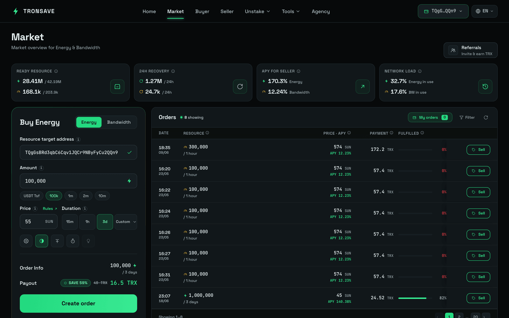
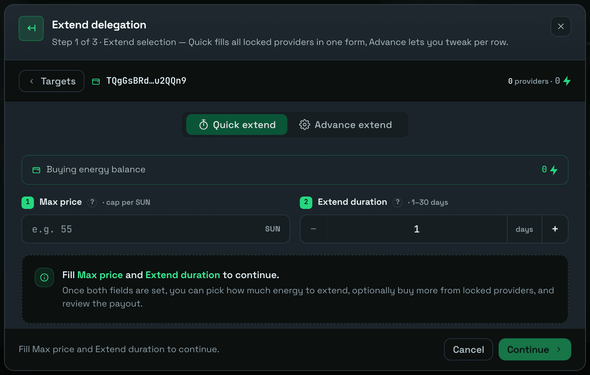

# 高级模式

**高级模式（Advance）** 是手动扩展模式。它不是一键充值，而是让你选择各个代理地址、为每个地址精确选择扩展方式，并将所有内容作为单笔支付进行确认。当你想要精确控制时长和数量，或需要一次性扩展多个已代理的区块时，可以使用该模式。

本指南分四个步骤介绍整个流程。

## 第 1 步 — 打开扩展（Extend）选项卡

先将你的钱包连接到市场，然后向下滚动到 **Extend** 部分，选择你想要扩展的订单。

<figure><figcaption>
打开扩展选项卡
</figcaption></figure>

## 第 2 步 — 选择"Advance"选项

<figure><figcaption></figcaption></figure>

## 第 3 步 — 调整扩展请求

高级模式面板初看起来可能信息密集。下面说明每个部分的作用。

<figure><figcaption></figcaption></figure>

**1. 批量控制。** 这些选项会将一个设置应用到每个所选请求：

* **使用相同设置（Using the same settings）** — 将相同的扩展和购买选项应用到所有选中的扩展和购买请求。
* **仅相同扩展（Same extend only）** — 将相同的扩展选项应用到所有选中的请求。
* **相同时长（Same duration）** — 将相同的时长应用到所有选中的请求。

**2. 代理地址表。** 该表列出了所有其已代理资源与目标地址匹配的代理地址。当某个代理地址可供扩展时，其**选择框**处于激活状态。使用 **All** 可一次性选择所有可用的代理地址。

当你选择一个代理地址时，扩展选项会出现。你可以选择以下三种模式之一：

### 仅扩展

选择从现在起 1 到 30 天的扩展时长。所选时长必须**大于**当前的到期时间。例如，如果现有代理还有 3 天到期，你必须选择 4 到 30 天的时长。


**示例**

* **旧代理：** A 向 B 代理了 100k，还有 3 天到期。
* 你选择将时长扩展到 5 天。
* **新代理：** A 向 B 代理了 100k，还有 5 天到期。


### 仅购买更多

如果该代理地址的剩余能量大于 100k，你可以在现有代理的基础上选择购买一定数量。


**示例**

* **旧代理：** A 向 B 代理了 100k，还有 3 天到期。
* 你选择再购买 100k 能量。
* **新代理：** A 向 B 代理了 200k，还有 3 天到期。


### 扩展并购买

如果该代理地址的剩余能量大于 100k，你可以在同一个请求中购买更多能量**并**选择从现在起 1 到 30 天的扩展时长。


**示例**

* **旧代理：** A 向 B 代理了 100k，还有 3 天到期。
* 你选择再购买 100k 能量并将时长扩展到 5 天。
* **新代理：** A 向 B 代理了 200k，还有 5 天到期。


所选项的预估支付金额显示在右侧。

<figure><figcaption></figcaption></figure>

**3. 汇总。** 显示所有选中项的扩展总量以及所有请求的预估支付总额。

## 第 4 步 — 确认并支付

在 **Extend Order Details（扩展订单详情）** 阶段，TronSave 会汇总每个扩展请求及其扩展数量和支付金额。请仔细核对，然后点击 **Extend** 开始签名转账交易。转账金额必须等于扩展支付金额才能发送你的请求。


请确保**转账交易**的金额与**支付（Payout）**中的金额相同。


<figure><figcaption></figcaption></figure>

<figure><figcaption>
转账金额必须与扩展订单确认（Extend Order Confirm）中显示的支付金额一致
</figcaption></figure>

核对完所有内容后，点击 **Sign transaction**。如果请求成功，会出现成功弹窗，流程进入 **Successfully（成功）** 阶段。

<figure><figcaption></figcaption></figure>

## 后续步骤

* 想要更快的充值方式？请参阅 [快速扩展](README.md)。
* 第一次租赁？从 [如何购买能量和带宽](../buy/README.md) 开始。
