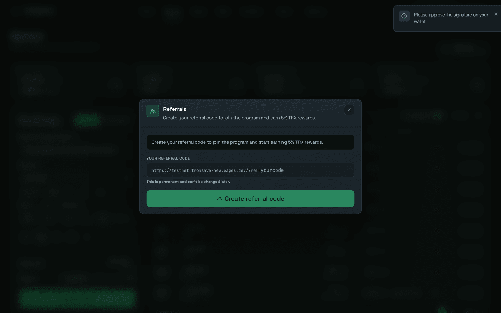
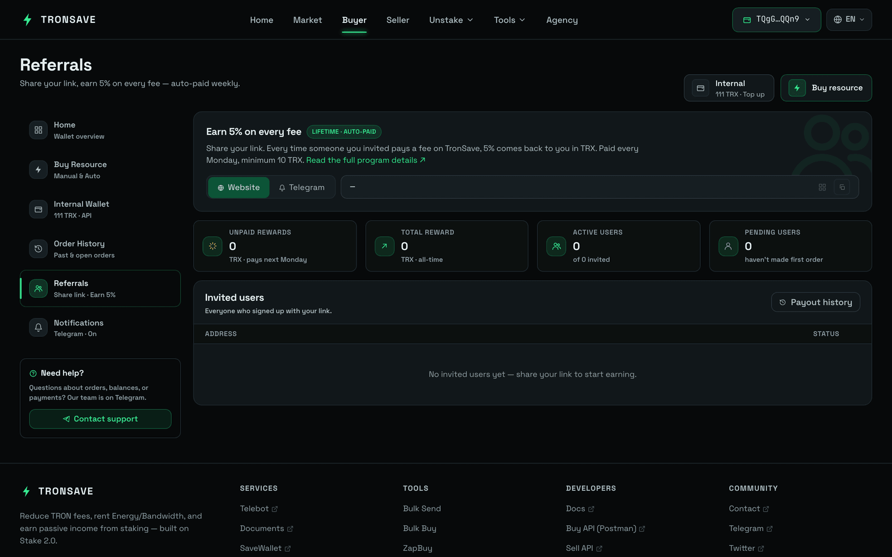

# 推荐计划

与好友分享您的推荐链接。当有人通过您的链接在 TronSave 上租赁能量时，您将根据他们每笔购买订单的总价值赚取 **5%** 的佣金。

推荐人数和奖励均无上限。

## 设置您的推荐链接

**第 1 步 — 连接您的钱包。** 打开 [tronsave.io](https://tronsave.io/market) 并连接您的 TRON 钱包（例如 TronLink）。

**第 2 步 — 点击 "Referral"（推荐）按钮。**

<figure><figcaption></figcaption></figure>

**第 3 步 — 输入您的赞助码（Sponsor Code）** _（可选）_。


如果有人向您发送了赞助链接，请使用该确切 URL 打开 TronSave，这样赞助码会被自动应用。


**第 4 步 — 生成您的推荐码** _（必填）_。

**第 5 步 — 点击 "Confirm"（确认）。**

<figure><figcaption></figcaption></figure>

## 追踪奖励与统计数据

<figure><figcaption></figcaption></figure>

1. 点击 **Copy**（复制）图标以复制您的推荐链接。
2. 查看您推荐计划的统计数据。
3. 点击 **History**（历史）按钮以查看您的奖励历史。

## 奖励如何发放


每当您推荐的用户创建订单时，您都会获得一份奖励。

奖励以 TRX 形式在每周一发放，最低发放金额为 10 TRX。


## 后续步骤

* [购买能量与带宽](buy/) — 您的被推荐人将进行的操作。
* [定价与 APY](../concepts/pricing-and-apy.md) — 订单价值的确定方式。
