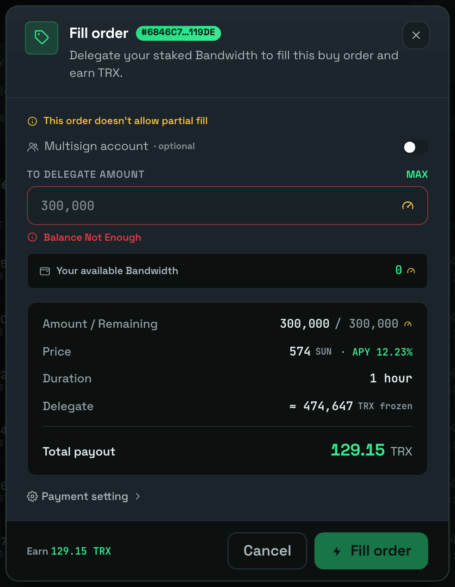

# 手动出售

手动出售让你可以从市场上挑选一个开放的买单，并用你已质押的资源亲自成交它。只有在某个买单**尚未**被自动撮合时，你才能手动成交它。


手动出售针对的是你已经质押的资源。如果你只持有 TRX，请先质押 —— 参见 [通过质押 2.0 获取能量](staking-2.0.md)。


## 开始之前

以下步骤适用于每一种手动出售方式。

### 第 1 步 —— 质押能量/带宽（可选）

_如果你已经拥有可用资源，请跳过此步骤。_

如果你只持有 TRX，尚未质押能量或带宽，请在出售前先进行质押。你可以通过以下任一方式完成：

* **直接在 TronSave 上质押** —— 参见 [通过质押 2.0 获取能量](staking-2.0.md)。
* **通过 TronScan 质押** —— 访问 [tronscan.org/#/wallet/resources](https://tronscan.org/#/wallet/resources)。

### 第 2 步 —— 连接你的 TRON 钱包

打开 [TronSave 市场](https://tronsave.io/market) 并连接你的钱包。分步说明请参见 [连接钱包](../connect-wallet.md)。

### 第 3 步 —— 找到一个买单并点击 **Sell**

浏览开放的买单，在你想成交的订单上点击 **Sell**。

<figure><figcaption>
点击 "Sell" 按钮
</figcaption></figure>

## 选项 1 —— 手动出售（普通）

### 输入代理（委托）数量

输入你想代理（委托）以成交该订单的资源数量。

<figure><figcaption></figcaption></figure>

### 可选 —— 设置收款（Setting payment）

你可以更改接收这笔手动能量出售订单利息的地址。选择 **Setting payment** 并输入接收地址。

<figure><figcaption></figcaption></figure>

### 点击 **Fill** 执行卖单

<figure><figcaption></figcaption></figure>

## 选项 2 —— 手动出售（MultiSign 多签）

**MultiSign** 功能让你能够使用另一个账户已向你授予代理（委托）权限的能量来成交买单，而不是使用你自己质押的资源。

### 点击 **MultiSign Delegating**

<figure><figcaption></figcaption></figure>

在成交订单表格中，填写以下字段：

<table>
<thead>
<tr><th>字段</th><th>说明</th></tr>
</thead>
<tbody>
<tr><td><code>MultiSign Account</code></td><td>已向你授予代理（委托）权限的地址。</td></tr>
<tr><td><code>To delegate amount</code></td><td>你想出售的能量数量。</td></tr>
</tbody>
</table>

你还可以在 **Setting payment** 下设置接收地址。

<figure><figcaption></figcaption></figure>

### 点击 **Fill** 执行卖单

<figure><figcaption></figcaption></figure>

## 后续步骤

* [通过质押 2.0 获取能量](staking-2.0.md) · [质押 2.0](../../concepts/staking-2.0.md)
* [能量与带宽](../../concepts/energy-and-bandwidth.md) · [定价与 APY](../../concepts/pricing-and-apy.md)
