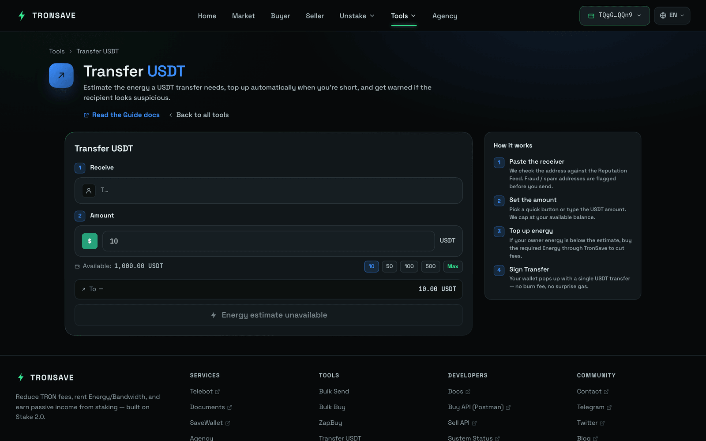

# 转账 USDT

**转账 USDT** 工具可在单个页面上向任意 TRON 地址发送 USDT（TRC‑20）。在广播之前，它会预估本次转账所需的[能量](../../concepts/energy-and-bandwidth.md)，并提供从 TronSave 市场购买该能量的选项以避免燃烧 TRX；如果接收方看起来像是欺诈或垃圾地址，它还会向你发出警告。

请在 [tronsave.io/tools/transfer-token](https://tronsave.io/tools/transfer-token)（位于 **Tools** 菜单下）打开它。

***

## 主要功能

### 一键 USDT 转账

在单笔交易中向任意 TRON 地址发送 USDT。该界面专为快捷支付而设计——输入接收地址和金额，确认后即可完成。

<figure><figcaption></figcaption></figure>

### 能量预估与优化

该工具会自动预估转账所需的能量。如果你的钱包能量不足，它将：

1. 提示你能量不足。
2. 提供从 TronSave 能量市场进行的**自动购买选项**。

通过租赁能量而非让网络燃烧 TRX，可以降低转账的整体成本。


一笔 USDT TRC‑20 转账会消耗能量。如果能量不足，TRON 会燃烧 TRX 来弥补差额，而这通常远比租赁昂贵。参见[能量与带宽](../../concepts/energy-and-bandwidth.md)。


### 欺诈与垃圾地址检测

在发送之前，该工具会将接收地址与欺诈/垃圾地址数据库进行比对。如果该地址被标记为可能存在恶意，你会看到一条警告消息，从而降低将 USDT 发送到不安全钱包的风险。

该检查使用 [TRONSCAN 安全服务 API](https://docs.tronscan.org/security-service/security-service-api#check-account-security)。

***

## 用户流程

1. 前往 [tronsave.io](https://tronsave.io/)，打开 **Tools** 菜单，然后点击[转账 USDT](https://tronsave.io/tools/transfer-token)。
2. 输入**接收地址**和**金额**。
3. **系统检查**——该工具会预估所需能量，并验证接收方是否被标记为潜在欺诈/垃圾地址。
4. **能量处理**——如果能量不足，该工具会显示由 TronSave 市场支持的**购买能量**选项。
5. **转账**——核对详细信息并确认。

***

## 优势

* 简单且安全的 USDT 转账。
* 通过按需购买能量将 TRX 成本降至最低。
* 通过实时接收方警告进行欺诈防范。

***

## 后续步骤

* [能量与带宽](../../concepts/energy-and-bandwidth.md) —— 为什么 USDT 转账需要能量。
* [术语表](../../concepts/glossary.md) —— 文档中使用的术语。
